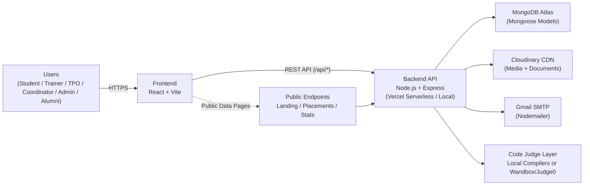
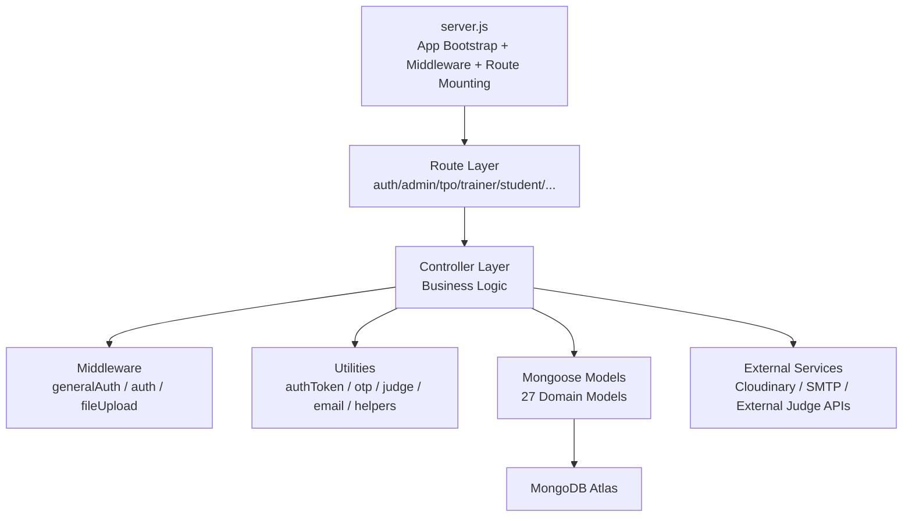
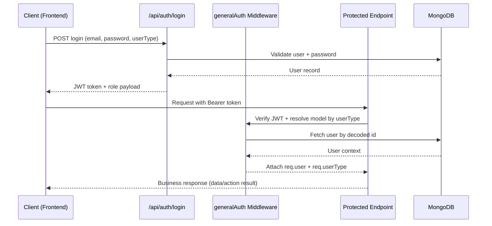

# INFOVERSE
## Placement Training, Assessment & Networking Platform
### Project Documentation

> Prepared from the current codebase state (as of February 24, 2026).

## 1. Project Overview
INFOVERSE is a production-oriented full-stack platform designed to support placement training operations across students, trainers, TPO teams, coordinators, administrators, and alumni. It centralizes training delivery, assessments, coding contests, attendance, notifications, and placement visibility into a single role-driven web application.

The platform currently supports these primary user groups:
- **Student** – Manage profile, upload resume, track attendance, access assignments/quizzes/contests/references, and view placement-related updates.
- **Trainer** – Manage assigned batches, conduct assessments, monitor attendance sessions, and engage students through academic content modules.
- **TPO** – Manage batches, assign trainers/coordinators, oversee approvals, monitor attendance analytics, and export placement reports.
- **Coordinator** – Handle attendance operations, profile/dashboard workflows, and student activity support functions.
- **Admin / Super Admin** – Perform secure administration, user management, batch governance, placement imports, and landing-content management.
- **Past Student (Alumni)** – Access self-service profile/placement portal functions.

---

## 2. System Architecture
INFOVERSE follows a layered architecture that separates UI, API/business logic, and data services for maintainability and scalable deployment.

| Layer | Technology | Runtime / Hosting Mode |
|---|---|---|
| Frontend (Presentation) | React + Vite + Tailwind CSS | Static build (Vercel-compatible) |
| Backend (Business Logic) | Node.js + Express.js | Vercel serverless (`@vercel/node`) + local Node runtime |
| Database (Data Layer) | MongoDB Atlas (Mongoose) | Cloud-hosted MongoDB |
| Media Storage | Cloudinary + Multer Storage | Cloudinary CDN |
| Email Service | Nodemailer + Gmail SMTP | SMTP via environment configuration |
| Code Execution Engine | Local compilers + external judge fallback (Wandbox / Judge0) | Local VM/host or serverless-compatible external API |

Communication uses HTTPS REST APIs between frontend and backend. The backend is serverless-aware (connection caching and reconnect middleware) and exposes health/debug endpoints for runtime diagnostics.

### 2.1 Architecture Diagrams

#### Diagram A: High-Level System Architecture

#### Diagram B: Backend Module Interaction

#### Diagram C: Request Flow (Auth + Protected API)

---

## 3. Technology Stack
### Frontend
- React (frontend package: v18.x)
- Vite build/dev tooling
- React Router DOM for routing
- Axios with auth-aware interceptors
- Tailwind CSS for styling
- Additional visualization/util packages: Recharts, FileSaver, xlsx, Framer Motion, React Icons/Lucide

### Backend
- Node.js + Express (Express 5.x)
- Mongoose for MongoDB persistence
- JWT-based auth token flow
- bcrypt/bcryptjs for password hashing and verification
- Nodemailer for OTP and account emails
- Multer + Cloudinary for media/document uploads
- ExcelJS / xlsx for import-export pipelines

### Infrastructure/Platform Notes
- CORS configured for multi-origin frontend deployment.
- Vercel-specific runtime support (serverless DB reconnection, `/tmp` usage for execution files).
- Environment-driven behavior for production/local execution.

---

## 4. Core Features
### 4.1 Authentication & Access Control
- Multi-role authentication pipeline for `student`, `trainer`, `tpo`, and `coordinator` via generalized auth APIs.
- Separate **super-admin login with OTP verification** flow (`login -> OTP -> token issuance`).
- Forgot/reset password flows implemented for admin and role-auth endpoints.
- JWT Bearer token validation middleware for protected route access.
- Account lock/failed-login handling appears in role models and auth controllers.

### 4.2 Role-Based Dashboards & Operations
- Dedicated API modules and frontend pages for Admin, TPO, Trainer, Student, and Coordinator.
- Admin controls include account provisioning (admin/trainer/tpo), status toggles, batch operations, and governance endpoints.
- TPO workflows include student lifecycle operations, trainer assignment, schedule exports, approvals, attendance reports, and placed-student exports.

### 4.3 Training & Academic Workflow
- Assignment management with batch targeting (`regular/noncrt/placement/both`), submissions, and grading.
- Quiz management with timed windows, batch restrictions, submissions, and performance metadata.
- Syllabus and reference/resource modules for learning distribution.
- Student activity tracking endpoints for multiple roles.

### 4.4 Coding Contest & Online Judge Workflow
- Contest creation/management with question banks, test cases, leaderboard, and participant/submission tracking.
- Code run/submit endpoints backed by judge utilities.
- Execution supports languages including Python, JavaScript, C, C++, and Java.
- Runtime strategy: local compiler execution in development, external judge APIs in serverless/production scenarios.

### 4.5 Attendance, Notifications & Event/Landing Workflows
- Attendance APIs across coordinator/trainer/student/tpo perspectives (daily, monthly, date-range, aggregate exports).
- Notification model supports role-targeted recipients, categories, read-state tracking, and persistence.
- Placement calendar/events modules and public landing/placements endpoints.
- Public-facing APIs expose landing content, placement statistics, and downloadable placement sheets.

### 4.6 File Upload & Content Pipelines
- Profile image upload to Cloudinary.
- Resume upload pipeline (PDF/DOC/DOCX with validations).
- Landing page media upload for hero/content assets.
- Excel upload and parsing flows for CRT batch creation and placement data import.

---

## 5. Database Design
The backend currently uses **27 Mongoose models**, including:
- `Admin`, `TPO`, `Trainer`, `Student`, `Coordinator`, `Alumni`, `User`
- `Batch`, `PlacementTrainingBatch`, `Attendance`, `Timetable`
- `Assignment`, `Submission`, `Quiz`, `Contest`, `CodingQuestion`, `syllabus`, `Reference`
- `Notification`, `Feedback`, `Complaint`, `Contact`, `Calendar`
- `Company`, `ImportHistory`, `LandingContent`, `OTP`

### Key Relationship Patterns
- Students are linked to both academic (`Batch`) and placement training (`PlacementTrainingBatch`) contexts.
- Placement batches link students, TPO ownership, coordinators, and assigned trainers with schedules.
- Assignments/quizzes connect trainers to target batches and track student submissions/results.
- Notifications support polymorphic sender/recipient references across multiple role models.

### Database Runtime Behavior
- Standard runtime and serverless-specific MongoDB connection modules are both implemented.
- Serverless connection logic includes cached connection reuse, retry attempts, and pool/timeouts suited for function environments.

---

## 6. Deployment & Operations Status
The repository is configured for **Vercel-compatible deployment**:
- Root/frontend `vercel.json` handles frontend static build and SPA routing.
- Backend `vercel.json` deploys Express API as a serverless Node function.
- Backend includes `VERCEL`-aware behavior (DB reconnect checks, temp path strategy for code execution).

Operationally, the project also supports local full-stack development with concurrent frontend/backend scripts in the monorepo.

---

## 7. Key Achievements (Current Codebase)
- Role-driven platform architecture spanning admin, operations, academic, and student workflows.
- OTP-enabled super-admin authentication and JWT-secured protected APIs.
- End-to-end placement training lifecycle (batching, trainer assignment, approvals, attendance, exports).
- Integrated assessment ecosystem (assignments, quizzes, coding contests, submissions, leaderboards).
- Cloudinary-backed media/document handling with validated upload flows.
- Public information delivery (landing content, placements, statistics, downloads).
- Serverless-aware backend engineering for Vercel runtime compatibility.

---

## 8. Future Enhancements
Potential roadmap items based on current architecture:
- Real-time notifications (WebSocket/Socket.IO) on top of existing persisted notifications.
- Redis-backed caching/session acceleration for high-volume analytics and dashboards.
- Richer proctoring and anti-cheat signals for coding assessments.
- Mobile client applications for student/trainer workflows.
- Stronger audit dashboards and security hardening (rate-limit/helmet enforcement coverage across all entry points).
- CI/CD quality gates (lint/test/build + deployment checks) for faster, safer releases.

---

## Team Lead
Pavani Kadari
kadaripavani1@gmail.com
